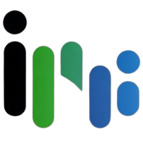

  

---

## About InternSync

InternSync, nama tersebut diambil dari gabungan kata "Intern" yang merujuk pada kegiatan magang, dan "Sync" yang berarti sinkronisasi atau keterpaduan. Filosofi di balik nama ini mencerminkan tujuan utama aplikasi, yaitu menciptakan keterhubungan yang selaras antara mahasiswa, dosen, dan dunia industri dalam proses penempatan magang. Dengan sinkronisasi data kompetensi, preferensi, dan kebutuhan masing-masing pihak, InternSync hadir sebagai jembatan digital yang mengintegrasikan seluruh elemen penting dalam ekosistem magang secara efisien dan terarah.

---

## Features

- 🤝 Integrated Internship Ecosystem  
- 🎯 Personalized Internship Matchings  
- 📚 Academic-Industry Synchronization 
- 📈 Progress Monitoring and Reporting
- 🔒 Secure Access Control  

---
